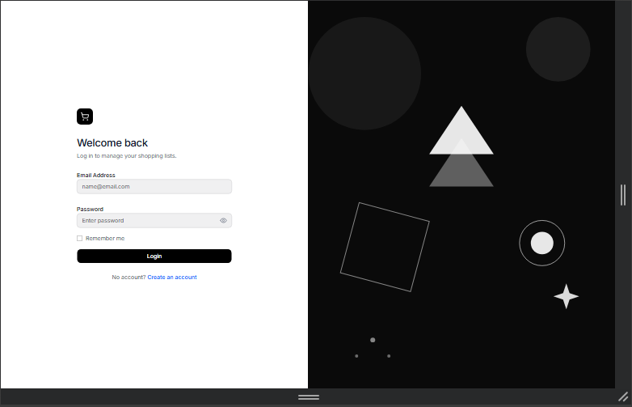

# Task-4-shoppingListApp

---

**Shopping List App** buit with React, TypeScript, Redux and JSON Server. Allows users to register, login and manage their shopping lists with full CRUD operations, search, sorting and filtering functionailities

---

## Screenshot 

<p align="center">
  
</p>

## Features

### Authentication

- User Registeration
- User Login
- Protect Routes
-  [JWT Token-based Authentication](https://www.youtube.com/watch?v=8aIXUMYWJds)

### Shopping List Manangement
- Create - Add new shopping lists
- Read - View all shopping lists
- Update - Edit list names and completion states
- Delete - Remove shopping lists with conformation

### Other functionaility
- Real-time search 
- Sorting options
- Filtering Capabilities

### Data Persistence
- JSON Server 
- Redux State Management

- https://medium.com/@panat.siriwong/lets-initialize-redux-the-toolkit-in-react-typescript-c533991fc97c

## Prerequisities
- Node.js (v14 or higer)
- npm 

### Getting Started

### How to run locally

```bash
# clone the repository 
git clone https://github.com/NeeloByron/Task_4_ShoppingListApp.git 
```

```bash
# Navigate to the project directory 
cd Task_4_ShoppingListApp
```

```bash
# Install Dependencies 
npm install 
```

```bash
# Install Additional Dependencies 
npm install -D concurrently @types/jsonwebtoken
npm install jsonwebtoken body-parser
```

```bash
# Run
npm run dev
```

## Technologies Used

- React - Frontend UI library
- TypeScript - Type-safe JavaScript
- Redux - State-management
- JSON Server - Mock REST API   
- JWT - Authentication 
- Concurrently - Run multiple commands concurrently

Acknowledgements 

- Authentication tutorial by  [JWT Authentication Tutorial](https://www.youtube.com/watch?v=8aIXUMYWJds)
- Redux setup guide by [Redux Toolkit Setup Guide](https://medium.com/@panat.siriwong/lets-initialize-redux-the-toolkit-in-react-typescript-c533991fc97c)